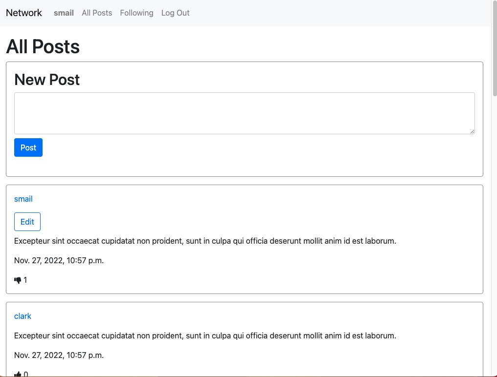

# Social Network

Project made for Harvard’s Web50 certificate course.

[Original project description/spec](https://cs50.harvard.edu/web/2020/projects/4/network/) 

## Description summary:

Make a twitter-like social network website for making posts and following users.

Users can:

- create new post
- view all posts
- have a profile page
- follow and unfollow other users
- like and unlike posts  

I also added tests for models and views of the application by using Django TestCase. 

## Home page screenshot
